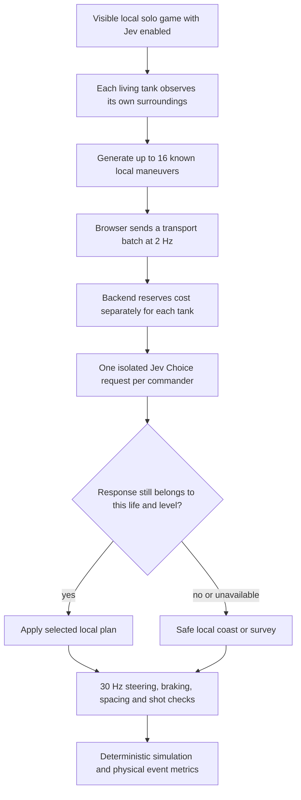

# Optional Jev commander

## Local operation

The static game starts with scripted AI and requires no backend. **Jev AI** enables the local experiment; **Player autopilot** also hands the main tank to Jev. Both are opt-in. Jev is restricted to visible, unpaused, local single-player games and at most three enemies plus one player. Decisions default to **2 Hz**, per the user's test direction. There is no production AI deployment in this experiment.

Run `npm run dev -- --host 127.0.0.1` and the optional process documented in [backend/README.md](backend/README.md). Keys stay in the server process. Reuse the same absolute ledger across every restart/worktree: `/Users/dmontauk/src-personal/ai-projects/spectre-remake/.jev-local/spend-2026-09-29.json`. The server stops paid calls at $9.50, below the authorized $10. Unknown usage, failures and timeouts retain the maximum reservation. Never reset the ledger to continue testing.

## Commander decision tree

Jev chooses a finite maneuver, not arbitrary controls or executable code. Player choices include collecting known flags/supplies, engaging, flanking, retreating and exploring. Enemy choices include attacking/flanking/retreating, searching for opponents and guarding a locally known flag. Enemies receive no collection tasks. The executor checks movement and firing each simulation tick; model choice quality and executor safety are measured separately.

## Information boundary

The commander always has its own operating status, public total/remaining flag counts, and local vision: contacts within 65 units, a 234-degree forward arc and unobstructed line of sight, plus visible obstacle geometry or four-unit tactile geometry. Intelligence deliberately expands with campaign level:

| Level | Authorized map and squad knowledge |
| --- | --- |
| 1–2 | Individually observed objectives; remembered flag coordinates are approximate. No advance objective list or hidden live opponent tracking. |
| 3–4 | Exact own map location and advance positions of typed flags, ammo and shield items. Visibility still limits opponent sightings. |
| 5+ | Other AI tank locations and their last accepted strategy. Enemy commanders receive the player's current sighting only while at least one enemy can see the player. |

Tank tracks record their last observed position and heading, observation tick/time, age relative to the current game time, and whether the sighting came from the commander or a shared spotter. Hidden moving targets retain their last observation; they do not acquire fresh coordinates or headings merely because game time advances. No tier reveals opponent health/ammo, RNG or the complete simulation.

Enemy mission instructions explicitly say to stop the player taking their flags. Two or fewer remaining flags increase interception urgency without bypassing survival or safety rules. Healthy enemies without a visible opponent receive progressing patrol/exploration choices; automatic idle guarding and peaceful regrouping are excluded after recorded tests showed long stationary stretches. Enemies without a visible opponent should patrol a defensive circuit around a known flag and look outward for the player. Protecting a flag remains a distinct deliberate choice. Recent incoming fire and low shield prioritize retreat or regrouping over pursuit. Tactical strategy and maneuver are recorded separately, so several local maneuvers can implement the same survival or patrol strategy.

Each upstream request contains **one tank's perspective only**. Multiple Jev questions share state, so combining all perspectives into one provider call would violate the boundary. Browser batching saves local transport overhead only. At four tanks and 2 Hz, the nominal load is eight provider calls/second. Two upstream calls may run concurrently.

Collision and firing guards use the local physical scene to brake and reject unsafe shots. They cannot choose a hidden objective or use a hidden target's new position to steer. This separation is deliberate: Jev selects tactics from limited knowledge; reflexes prevent immediate physical mistakes. Nearby moving bodies require relative-motion prediction; replanning must preserve a viable braking trajectory. Friendly-fire safety checks the actual projectile heading, including the enemy's post-movement heading. Normal weapon cooldowns still apply.

## Evaluation and fun hypotheses

Run `node scripts/jev-evaluate.mjs --enabled=true --autopilot=true --hz=2 --level=3 --duration=90 --video=true --output=reference/verification/jev/<run>` only after reviewing the backend cap. God mode stays off. The harness stops for roster violations, game over or budget exhaustion. Requested seeds are recorded but **not applied**; the game's built-in deterministic level seeds are used. No multi-seed win-rate claim is warranted yet.

| Measure | Desired result / interpretation |
| --- | --- |
| Accepted decisions per living tank-second | Approximately 2 Hz; aim for at least 1.8 Hz |
| Complete batch latency | p95 below 500 ms for the 2 Hz interval |
| Model command coverage | At least 95%; fallback is counted separately |
| Physical obstacle/tank contacts and friendly damage | Zero in acceptance runs; interventions are not collisions |
| Flags, kills, level clears, damage and life losses | Demonstrate real progress and enemy pressure without invulnerability |
| Applied maneuver categories | Purposeful objectives, attack/flank/retreat/search; no enemy supply chase |
| Stationary time and progress gaps | Inspect extended inactivity; deliberate firing/guarding differs from a deadlock |
| Recoverable close calls | Player reaches <=25% shield and escapes/heals without a life reset |
| Human win rate and fun | Hypothesis: 40–70% wins after practice, meaningful tactical choices and close calls; requires repeated varied trials and human play |

Tick events measure actual contacts/damage. Trajectory distance, stationary seconds and low-shield recoveries are explicitly sample-derived from 200 ms snapshots. A death/respawn is not a recovery. Autopilot is a test opponent, not a human fun rating. Safety regression tests and watchable gameplay are required alongside build/test success.

## Evidence

Reports and gameplay are in [reference/verification/jev/](reference/verification/jev/). Each compact report has a companion `samples.json.gz` preserving its full sampled state for reproduction. Failed and intermediate runs are retained, including the original HTTP400 wire mismatch, a spacing deadlock, dynamic tank contacts and a windmill impact. Later acceptance evidence must be read against the exact code revision and configuration recorded in the evaluation summary.

## Decision audit and live log

Every new upstream call is saved locally before transmission, then completed with its result or error. Entries include UTC timestamps, game tick, tank identity, exact provider state/instructions/choices, selected choice, confidence, usage and cost when available. An unmatched start after interruption remains visibly pending/unknown. Credentials and authorization headers are excluded. The audit is persistent across server restarts and separate from the cumulative spending ledger; it must not be reset during testing.

The live decision window presents concise tank/strategy/maneuver summaries with latency and outcome. Exact input state and options are collapsed by default and expandable per call. Model choices, browser application/staleness and local fallback are distinguished; summaries describe supplied choices rather than inventing model reasoning. The visible list is bounded for responsiveness, while the durable backend history preserves every recorded call. Logging begins with this version; previous calls cannot be reconstructed from aggregate spending statistics.
